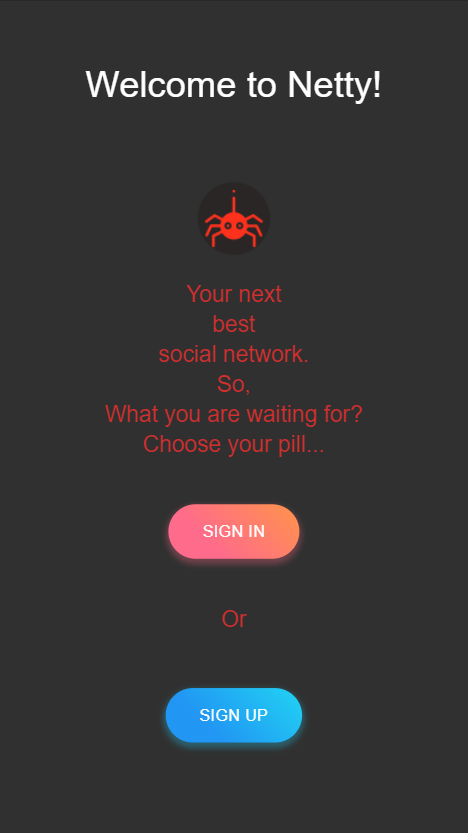
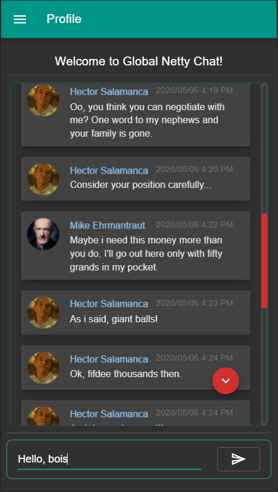
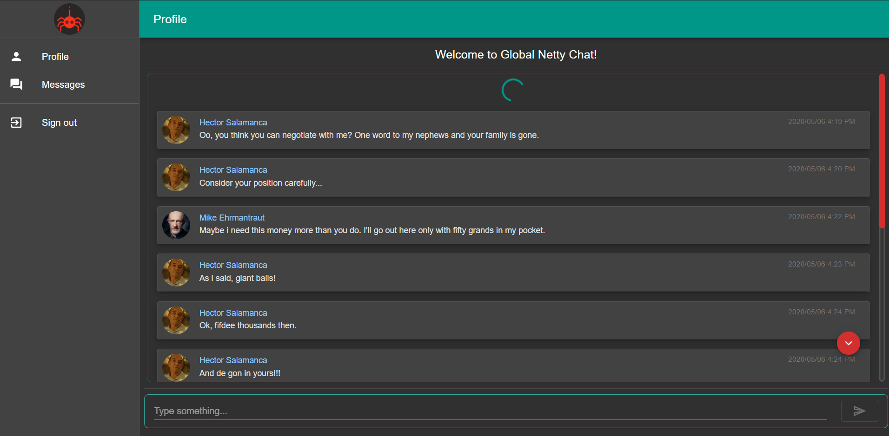
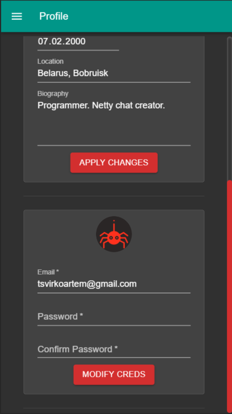
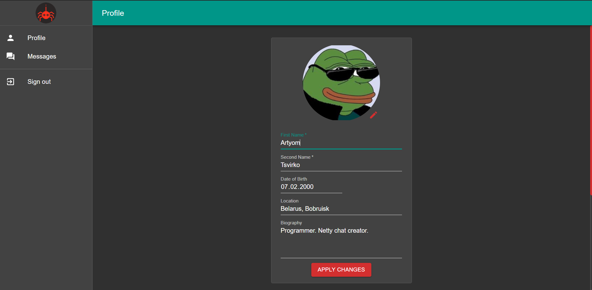
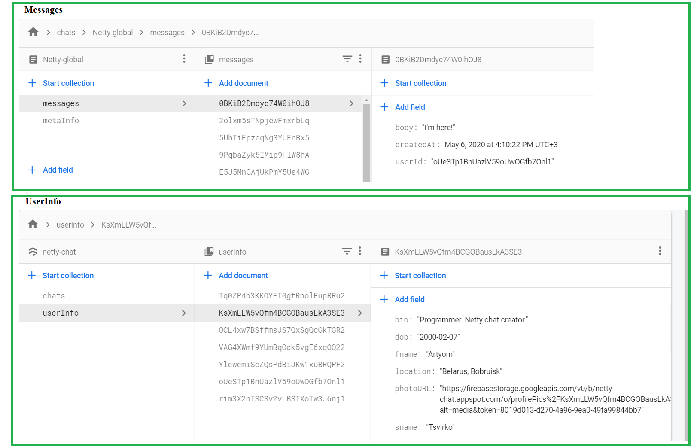

Check out [Netty live chat](https://netty-chat.web.app/).

## Some Netty chat page views

### Authentication page view

### Messages page view

#### Mobile

#### Desktop

### Profile page view

#### Mobile

#### Desktop

### Database

## Tips for potential contributors

Make a fork, clone the repo, open in favorite code editor, and you are ready for development! Sounds easy, huh?
I left out all necessary firebase configurations open for public, so feel free to use them for dev purposes only!
Here some scripts for you:

### `npm install`

Installs all necessary packages to boot up the app.

### `npm start`

Runs the app in the development mode. 
Open [http://localhost:3000](http://localhost:3000) to view it in the browser.

The page will reload if you make edits. 
You will also see any lint errors in the console.

### `npm run build`

Builds the app for production to the `build` folder. 
It correctly bundles React in production mode and optimizes the build for the best performance.

The build is minified and the filenames include the hashes. 
Your app is ready to be deployed!

See the section about [deployment](https://facebook.github.io/create-react-app/docs/deployment) for more information.

## Learn More

To learn React, check out the [React documentation](https://reactjs.org/)

To learn Redux, check out the [Redux documentation](https://redux.js.org/)

To learn Firebase, check out the [Firebase documentation](https://firebase.google.com/docs)

Learn more about Material-UI at [Material-UI documentation](https://material-ui.com/)

Special thank you to [Net Ninja](https://www.youtube.com/channel/UCW5YeuERMmlnqo4oq8vwUpg) and [Classsed](https://www.youtube.com/channel/UC2-slOJImuSc20Drbf88qvg) for their tutorials. Check out their channels.

## Thank you, reader!

Do not hesitate to leave a star, fork and create pull requests!
